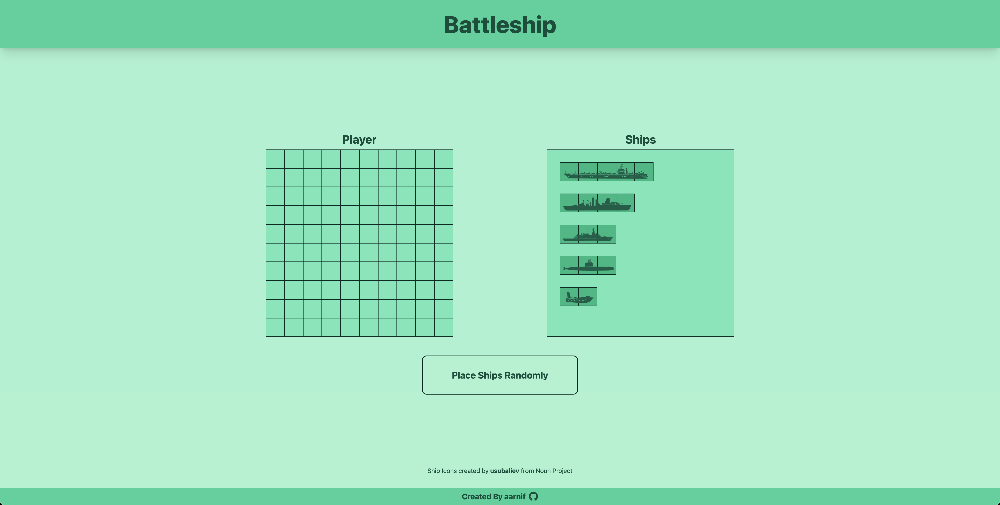
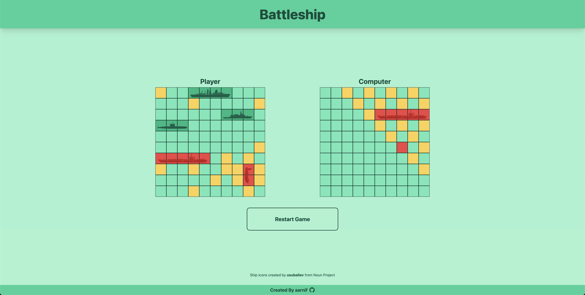

# Battleship

This is a implementation of the classic game Battleship played in the browser. The game is played against the computer.
The project is part of the [The Odin Project's](https://www.theodinproject.com/) Full Stack JavaScript path.

## Features

- Users can drag and drop their ships onto the board.
- Users can rotate their ships.
- Users can play against the computer.

## Live Preview

[Battleship](https://battleship-aarnif.netlify.app)

## Technologies

- Vite + React
- Tailwind CSS
- HTML

## Icons

- [React Icons](https://react-icons.github.io/react-icons/) (Github Icon)
- [usubaliev, The Noun Project](https://thenounproject.com/creator/usubaliev/) (Ship Icons)

## Images

Ship placement
 

Gameplay
 
